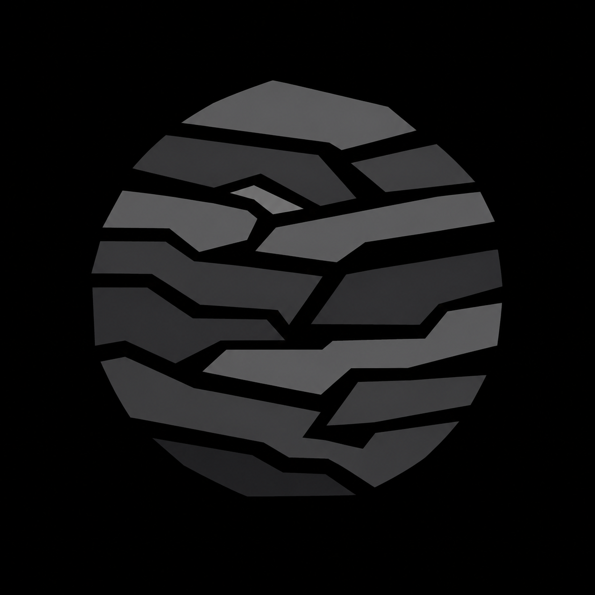

<p align="center">
  
</p>

<h1 align="center">Bedrock Browser</h1>

<p align="center">
  A production-grade, fully autonomous, open-source desktop browser built on Chromium.<br>
  No vendor backend. No account. No telemetry. Licensing recorded before code.
</p>

---

## What this is

Bedrock is a **Chromium-derived browser**, not an Electron app, not a WebView wrapper, not a
shell over someone else's build. This repository is the **overlay**: patches, new source files,
build args, branding and tooling. `build/sync.py` fetches the pinned Chromium tree and applies
them. See [ADR 0001](docs/adr/0001-chromium-overlay.md) for why overlay and not fork.

## AI agents & new contributors start here

This repository keeps a **maintained project memory** so context is restored by reading two
short files instead of the whole tree:

1. [`.ai/MEMORY.md`](.ai/MEMORY.md) — what Bedrock is, the non-negotiables, the layout, the
   working agreement.
2. [`.ai/memory/STATE.md`](.ai/memory/STATE.md) — where the work stands right now, what actually
   runs in CI versus what needs a real Chromium build, and the open threads.

That is the whole restore (~2.5k tokens). From there, open on demand:
[`MAP.md`](.ai/memory/MAP.md) (generated file-by-file map — use it instead of grepping),
[`INVARIANTS.md`](.ai/memory/INVARIANTS.md) (what must stay true, and which gate checks it),
[`DECISIONS.md`](.ai/memory/DECISIONS.md) (why it is like this),
[`HISTORY.md`](.ai/memory/HISTORY.md) (what landed, newest first).
[`AGENTS.md`](AGENTS.md) points auto-loading agents at the same entry point.

**The memory is updated in the same PR as the change it describes** — the procedure is
[`.ai/memory/PROTOCOL.md`](.ai/memory/PROTOCOL.md), the map is regenerated with
`python3 scripts/gen_memory.py`, and `scripts/check_memory.py` fails CI when the map is stale,
a new code directory is undescribed, or code changed without the memory following. Memory that
is optional is memory that is wrong within a month.

## Principles

1. **Autonomous.** Everything — history, bookmarks, passwords, profiles, sessions, settings,
   extensions, downloads, privacy engine, content blocker, fingerprint protection, cookies,
   permissions, search, themes — works on the user's device. Bedrock operates **no server** of
   any kind: no cloud backend, account, sync, telemetry, analytics, proxy or VPN.
   The browser still talks to the sites, search engine and DNS resolver the *user* chooses —
   it simply never inserts our infrastructure in between.
2. **Licensing first.** Nothing lands without a provenance row and a notice file.
   CI enforces it: [`scripts/check_provenance.py`](scripts/check_provenance.py).
3. **Inspiration, not copying.** Brave, Firefox, Tor Browser, uBlock Origin and Privacy Badger
   inform the design. What is legally reusable, what is reimplemented and what is off-limits is
   decided per project in [`docs/THIRD_PARTY.md`](docs/THIRD_PARTY.md) — including the hard
   GPL-3.0 boundary around uBlock Origin and Privacy Badger.

## Repository layout

```
build/          chromium.pin (pinned base), sync.py (fetch + overlay), args/*.gn
patches/        patches against the Chromium tree (bedrock/ and upstream/<project>/)
src_overrides/  new files mirrored into the Chromium tree layout (preferred over patches)
  bedrock/privacy/    core · fingerprinting · tracker_blocker · storage · network · security · stats
  bedrock/ui themes settings search omnibox extensions profiles workspaces session
  bedrock/history bookmarks passwords downloads devtools updater perf fuzz
docs/           LICENSING.md, THIRD_PARTY.md, BUILD.md, adr/, design/, research/
THIRD_PARTY_NOTICES/  one notice file per dependency, 1:1 with the inventory
scripts/        the CI gates (licensing, telemetry, perf claims, languages, memory, ...)
.ai/            project memory for AI agents and new contributors
branding/       Bedrock name and logo assets
```

The subsystem tree and the places where Chromium's layout wins instead are decided in
[ADR 0003](docs/adr/0003-source-layout.md); languages (C++ / Rust / TypeScript, and no Electron)
in [ADR 0004](docs/adr/0004-languages.md).

## Build

See [docs/BUILD.md](docs/BUILD.md). Short version, Linux x64:

```bash
python3 build/sync.py --workspace ~/bedrock-src   # ~100 GB, long
# then the gn gen / autoninja commands sync.py prints
```

## Status

| Roadmap | State |
|---|---|
| 1–5 Foundation (engine, autonomy, licensing) | done — overlay build system + provenance gate |
| 6 Search engine system | designed + selection logic landed, host-tested |
| 7 Address bar / omnibox | designed + input classifier landed, host-tested |
| 8 Privacy Engine | architecture + feature registry landed |
| 9–10 Anti-fingerprinting | 4 levels, deterministic derivation, 21 documented surfaces |
| 11 Protection Controller | per-site/domain/global resolver landed, host-tested |
| 12 Content blocker | ABP/uBO-syntax filter engine, token-indexed, 50k rules in ~0.2 us |
| 13 One blocking pipeline | single `Evaluate()`; lists, heuristic and shields are stages |
| 14 Behavioral detection | Privacy Badger-style local learning, GPC/DNT, link cleaning |
| 15 Storage isolation | one StorageKey for every backend, incl. cache, DNS and HSTS |
| 16 HTTPS | upgrade / HTTPS-Only, mixed content, per-host cert exceptions only |
| 17 DNS | system default, named DoH providers, fail-closed strict mode |
| 18 WebRTC | Default / Privacy / Strict, no local IP outside Default |
| 19 Browsing modes | Normal / Private / Tor transport, circuit isolation, no "anonymous" claims |
| 20 Private window | one teardown path, shared with New Identity |
| 21 Profiles | Personal/Work/School/Temporary/Custom, nothing shared |
| 22 New Identity | plan shown up front, partial results reported honestly |
| 23 Extensions | Chromium-compatible API, generated disclosure, updates cannot grow powers |
| 24 Security baseline | audited in tests; forbidden switches rejected |
| 25 PrivacyPolicy | one resolver for all ten layers, 84 combinations checked for conflicts |
| 26 Visual language | design tokens + self-contained window mockup |
| 27 Design philosophy | taste limits enforced by `scripts/check_ui_style.py` |
| 28 Theme system | 5 modes, 14 live properties, contrast validation |
| 29 Live customization | `ApplyKind` has no "restart required" value |
| 30 Tab system | one model, two layouts, groups/pinned/sleeping/search/duplicates |
| 31 Sidebar | 8 panels, optional, every one reachable without it |
| Extension catalog | designed ([009](docs/design/009-extension-catalog.md)) |
| 32–35 Workspaces, downloads, passwords, bookmarks and history | done |
| 36–38 DevTools privacy panels, Privacy Center, per-site privacy panel | done |
| PrivacyTools.io ecosystem | catalog, recommendation engine, knowledge center, posture view |
| 39–42 Zero telemetry, provider-agnostic updates, open-source and reproducibility gates | done |
| 43 Fuzzing and sanitizers | 4 libFuzzer harnesses + deterministic CI smoke, ASan/MSan/TSan/fuzz configs |
| 44 Threat model | 14 adversaries, each with where Bedrock's protection ends |
| 45 Security levels | Standard / Balanced / Strict / Maximum as the single source of truth |
| 46 Performance budgets | 6 metrics measured per commit, 8 marked pending until a real build |
| 47 Source layout | subsystem tree landed; deviations from the proposal justified in [ADR 0003](docs/adr/0003-source-layout.md) |
| 48 Languages | C++ engine, Rust behind one FFI door, TypeScript for WebUI, never Electron — [ADR 0004](docs/adr/0004-languages.md), gated |
| 49 Firefox research | mechanism-by-mechanism verdicts and licence position in [docs/research/FIREFOX.md](docs/research/FIREFOX.md) |
| 50 Brave research | [docs/research/BRAVE.md](docs/research/BRAVE.md) — CNAME uncloaking, query stripping, referrer and client-hints policy queued |
| 51 Tor Browser research | [docs/research/TOR_BROWSER.md](docs/research/TOR_BROWSER.md) — letterboxing and circuit display queued; no anonymity claim |
| 52 uBlock Origin research | [docs/research/UBLOCK_ORIGIN.md](docs/research/UBLOCK_ORIGIN.md) + per-list licence inventory in [docs/privacy/FILTER_LISTS.md](docs/privacy/FILTER_LISTS.md) |
| 53 Privacy Badger research | [docs/research/PRIVACY_BADGER.md](docs/research/PRIVACY_BADGER.md) — cookie-blocking as the default learned outcome; DNT policy allowlist refused |
| 54 "Origin Tools" | searched, no such project exists — [docs/research/ORIGIN_TOOLS.md](docs/research/ORIGIN_TOOLS.md); nothing invented |
| 55 No fake features | feature registry carries a Status; UI renders only enforced features; `scripts/check_no_fake_features.py` |
| 56 Configuration system | GUI / config file / policy / CLI from one table, strict parsing, [docs/CONFIGURATION.md](docs/CONFIGURATION.md) |
| 57 Enterprise / power user | advanced settings with 9 guards no setting or policy can break — [docs/CONFIGURATION.md](docs/CONFIGURATION.md#advanced-settings) |
| 58 Reset / recovery | five actions, each stating what it leaves alone; typed confirmation + export offer before anything irreversible |
| 59 Import / export | five documented formats, versioned, secret-free — [docs/FORMATS.md](docs/FORMATS.md) |
| 60 Accessibility | eight requirements with evidence, mockups gated — [docs/ACCESSIBILITY.md](docs/ACCESSIBILITY.md) |
| 61 Localization | catalog-only strings, four complete locales, named placeholders and CLDR plurals — [docs/LOCALIZATION.md](docs/LOCALIZATION.md) |
| 62 Platform support | Windows and Linux supported, macOS best effort; platform macros confined to the platform layer — [ADR 0005](docs/adr/0005-platform-abstraction.md) |
| 63 Windows UX | eleven integration points with owner and failure mode — [docs/PLATFORMS.md](docs/PLATFORMS.md#windows-item-63) |
| 64 Linux UX | Wayland **and** X11, portals over desktop guesses, six package formats — [docs/PLATFORMS.md](docs/PLATFORMS.md#linux-item-64) |
| 65 Branding | own name, mark (full + small variant), palette and voice; gate keeps other vendors' brands out of the UI — [docs/BRAND.md](docs/BRAND.md) |
| 66 Engine version management | pipeline, cadence and security deadlines — [docs/UPSTREAM_SYNC.md](docs/UPSTREAM_SYNC.md) |
| 67 Patch management | required patch header incl. `Drop-When`, one patch one purpose — [docs/PATCHES.md](docs/PATCHES.md) |
| 68 Sync tooling | `scripts/upstream_sync.py` — pin status, header audit, `git apply --check` conflict detection, roll plan |
| 69 Security update priority | `updater/release_policy.{h,cc}`: features are dropped, the security release is never delayed |
| 70+ | awaiting specification |

Design docs live in [`docs/design/`](docs/design). Pure logic ships with dependency-free host
tests — `./scripts/run_host_tests.sh` builds and runs them with plain `g++`, no Chromium
checkout required, and CI runs them on every PR.

## License

Bedrock's own code: **MPL-2.0** ([LICENSE](LICENSE)) — chosen for compatibility with Chromium's
BSD-3 base and with MPL-2.0 sources such as brave-core. Rationale in
[docs/LICENSING.md](docs/LICENSING.md).

Bedrock is not affiliated with, endorsed by or sponsored by Google, Brave Software, Mozilla,
the Tor Project, Raymond Hill or the Electronic Frontier Foundation. All trademarks belong to
their owners and are used descriptively only.
